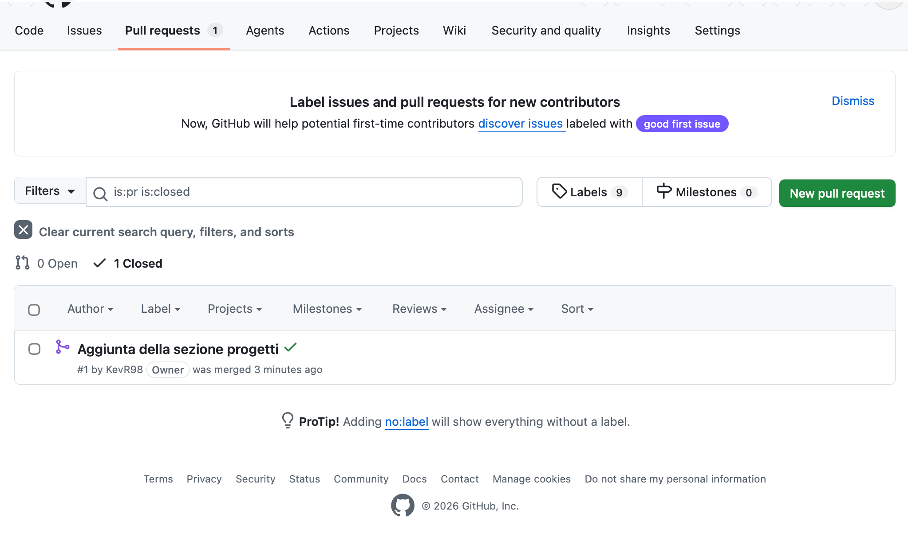

STORICO DI TUTTO IL TERMINALE CON EVENTUALI ERRORI

Last login: Thu May 7 15:54:13 on ttys000
biiin98@MacBook-Air-di-Kevin Lezione % mkdir portfolio-kevin
biiin98@MacBook-Air-di-Kevin Lezione % cd portfolio-kevin
biiin98@MacBook-Air-di-Kevin portfolio-kevin % mkdir assets
biiin98@MacBook-Air-di-Kevin portfolio-kevin % cd assets
biiin98@MacBook-Air-di-Kevin assets % mkdir css
biiin98@MacBook-Air-di-Kevin assets % mkdir js
biiin98@MacBook-Air-di-Kevin assets % mkdir img
biiin98@MacBook-Air-di-Kevin assets % cd css
biiin98@MacBook-Air-di-Kevin css % cd ..
biiin98@MacBook-Air-di-Kevin assets % cd ..
biiin98@MacBook-Air-di-Kevin portfolio-kevin % nano index.html
biiin98@MacBook-Air-di-Kevin portfolio-kevin % nano README.md
biiin98@MacBook-Air-di-Kevin portfolio-kevin % cd assets
biiin98@MacBook-Air-di-Kevin assets % cd css
biiin98@MacBook-Air-di-Kevin css % checkout style.css
zsh: command not found: checkout
biiin98@MacBook-Air-di-Kevin css % touch style.css
biiin98@MacBook-Air-di-Kevin css % cd ..
biiin98@MacBook-Air-di-Kevin assets % cd ..
biiin98@MacBook-Air-di-Kevin portfolio-kevin %
biiin98@MacBook-Air-di-Kevin portfolio-kevin % git init
hint: Using 'master' as the name for the initial branch. This default branch name
hint: will change to "main" in Git 3.0. To configure the initial branch name
hint: to use in all of your new repositories, which will suppress this warning,
hint: call:
hint:
hint: git config --global init.defaultBranch <name>
hint:
hint: Names commonly chosen instead of 'master' are 'main', 'trunk' and
hint: 'development'. The just-created branch can be renamed via this command:
hint:
hint: git branch -m <name>
hint:
hint: Disable this message with "git config set advice.defaultBranchName false"
Inizializzato repository Git vuoto in /Users/biiin98/Documents/ITS Mobilita Academy/Architettura Client Server & GIT/Lezione/portfolio-kevin/.git/
biiin98@MacBook-Air-di-Kevin portfolio-kevin % git config --global init.defaultBranch main
biiin98@MacBook-Air-di-Kevin portfolio-kevin % git branch -m main
biiin98@MacBook-Air-di-Kevin portfolio-kevin % git init
Reinizializzato repository Git esistente in /Users/biiin98/Documents/ITS Mobilita Academy/Architettura Client Server & GIT/Lezione/portfolio-kevin/.git/
biiin98@MacBook-Air-di-Kevin portfolio-kevin % git statys
git: 'statys' non è un comando git. Vedi 'git --help'.

Il comando maggiormente simile è
status
biiin98@MacBook-Air-di-Kevin portfolio-kevin % git status
Sul branch main

Non ci sono ancora commit

File non tracciati:
(usa "git add <file>..." per includere l'elemento fra quelli di cui verrà eseguito il commit)
.DS_Store
README.md
assets/
index.html

non è stato aggiunto nulla al commit ma sono presenti file non tracciati (usa "git add" per tracciarli)
biiin98@MacBook-Air-di-Kevin portfolio-kevin % git add .
biiin98@MacBook-Air-di-Kevin portfolio-kevin % git commit -m "Aggiunta dello scheletro di index.html"
[main (commit radice) e68878e] Aggiunta dello scheletro di index.html
5 files changed, 12 insertions(+)
create mode 100644 .DS_Store
create mode 100644 README.md
create mode 100644 assets/.DS_Store
create mode 100644 assets/css/style.css
create mode 100644 index.html
biiin98@MacBook-Air-di-Kevin portfolio-kevin % git add index.html
biiin98@MacBook-Air-di-Kevin portfolio-kevin % git commit -m "Aggiunta delle competenze"
[main 3b38af5] Aggiunta delle competenze
1 file changed, 30 insertions(+), 2 deletions(-)
biiin98@MacBook-Air-di-Kevin portfolio-kevin % cd assets/css
biiin98@MacBook-Air-di-Kevin css % git add style.css
biiin98@MacBook-Air-di-Kevin css % git commit -m "Aggiunta degli stili"
[main 1acf706] Aggiunta degli stili
1 file changed, 14 insertions(+)
biiin98@MacBook-Air-di-Kevin css % git log --oneline
1acf706 (HEAD -> main) Aggiunta degli stili
3b38af5 Aggiunta delle competenze
e68878e Aggiunta dello scheletro di index.html
biiin98@MacBook-Air-di-Kevin css % git remote add origin https://github.com/KevR98/portfolio-kevinramil-github.git
biiin98@MacBook-Air-di-Kevin css % git branch -m main
biiin98@MacBook-Air-di-Kevin css % git push -u origin main
Enumerazione degli oggetti in corso: 17, fatto.
Conteggio degli oggetti in corso: 100% (17/17), fatto.
Compressione delta in corso, uso fino a 10 thread
Compressione oggetti in corso: 100% (14/14), fatto.
Scrittura degli oggetti in corso: 100% (17/17), 3.16 KiB | 3.16 MiB/s, fatto.
Total 17 (delta 4), reused 0 (delta 0), pack-reused 0 (from 0)
remote: Resolving deltas: 100% (4/4), done.
To https://github.com/KevR98/portfolio-kevinramil-github.git

- [new branch] main -> main
  branch 'main' set up to track 'origin/main'.
  biiin98@MacBook-Air-di-Kevin css % git add README.md
  fatal: lo specificatore percorso 'README.md' non corrisponde ad alcun file
  biiin98@MacBook-Air-di-Kevin css % cd ..
  biiin98@MacBook-Air-di-Kevin assets % cd ..
  biiin98@MacBook-Air-di-Kevin portfolio-kevin % git add README.md
  biiin98@MacBook-Air-di-Kevin portfolio-kevin % git commit -m "Aggiornato il README.md"
  Sul branch main
  Il tuo branch è aggiornato rispetto a 'origin/main'.

Modifiche non nell'area di staging per il commit:
(usa "git add <file>..." per aggiornare gli elementi di cui sarà eseguito il commit)
(usa "git restore <file>..." per scartare le modifiche nella directory di lavoro)
modificato: README.md

nessuna modifica aggiunta al commit (usa "git add" e/o "git commit -a")
biiin98@MacBook-Air-di-Kevin portfolio-kevin % git add README.md
biiin98@MacBook-Air-di-Kevin portfolio-kevin % git commit -m "Aggiornato il file README.md"
[main 121c94e] Aggiornato il file README.md
1 file changed, 25 insertions(+), 2 deletions(-)
biiin98@MacBook-Air-di-Kevin portfolio-kevin % git push  
Enumerazione degli oggetti in corso: 5, fatto.
Conteggio degli oggetti in corso: 100% (5/5), fatto.
Compressione delta in corso, uso fino a 10 thread
Compressione oggetti in corso: 100% (3/3), fatto.
Scrittura degli oggetti in corso: 100% (3/3), 815 bytes | 815.00 KiB/s, fatto.
Total 3 (delta 1), reused 0 (delta 0), pack-reused 0 (from 0)
remote: Resolving deltas: 100% (1/1), completed with 1 local object.
To https://github.com/KevR98/portfolio-kevinramil-github.git
1acf706..121c94e main -> main
biiin98@MacBook-Air-di-Kevin portfolio-kevin % git remote -v
origin https://github.com/KevR98/portfolio-kevinramil-github.git (fetch)
origin https://github.com/KevR98/portfolio-kevinramil-github.git (push)
biiin98@MacBook-Air-di-Kevin portfolio-kevin % git checkout feature/progetti
error: lo specificatore percorso 'feature/progetti' non corrisponde ad alcun file noto a git
biiin98@MacBook-Air-di-Kevin portfolio-kevin % git checkout -b feature/progetti
Si è passati a un nuovo branch 'feature/progetti'
biiin98@MacBook-Air-di-Kevin portfolio-kevin % git add .
biiin98@MacBook-Air-di-Kevin portfolio-kevin % git commit -m "Aggiunta della sezione progetti"
[feature/progetti 8fa3f69] Aggiunta della sezione progetti
3 files changed, 41 insertions(+), 16 deletions(-)
create mode 100644 git.md
biiin98@MacBook-Air-di-Kevin portfolio-kevin % git push origin feature/progetti
Enumerazione degli oggetti in corso: 12, fatto.
Conteggio degli oggetti in corso: 100% (12/12), fatto.
Compressione delta in corso, uso fino a 10 thread
Compressione oggetti in corso: 100% (6/6), fatto.
Scrittura degli oggetti in corso: 100% (7/7), 1.06 KiB | 1.06 MiB/s, fatto.
Total 7 (delta 2), reused 0 (delta 0), pack-reused 0 (from 0)
remote: Resolving deltas: 100% (2/2), completed with 2 local objects.
remote:
remote: Create a pull request for 'feature/progetti' on GitHub by visiting:
remote: https://github.com/KevR98/portfolio-kevinramil-github/pull/new/feature/progetti
remote:
To https://github.com/KevR98/portfolio-kevinramil-github.git

- [new branch] feature/progetti -> feature/progetti
  biiin98@MacBook-Air-di-Kevin portfolio-kevin % git checkout main
  Si è passati al branch 'main'
  Il tuo branch è aggiornato rispetto a 'origin/main'.
  biiin98@MacBook-Air-di-Kevin portfolio-kevin % git pull origin main
  Da https://github.com/KevR98/portfolio-kevinramil-github
- branch main -> FETCH_HEAD
  Già aggiornato.
  biiin98@MacBook-Air-di-Kevin portfolio-kevin % git git checkout main
  git: 'git' non è un comando git. Vedi 'git --help'.

Il comando maggiormente simile è
init
biiin98@MacBook-Air-di-Kevin portfolio-kevin % git checkout main
Si è passati al branch 'main'
Il tuo branch è aggiornato rispetto a 'origin/main'.
biiin98@MacBook-Air-di-Kevin portfolio-kevin % git pull origin main
remote: Enumerating objects: 1, done.
remote: Counting objects: 100% (1/1), done.
remote: Total 1 (delta 0), reused 0 (delta 0), pack-reused 0 (from 0)
Decompressione degli oggetti in corso: 100% (1/1), 907 bytes | 907.00 KiB/s, fatto.
Da https://github.com/KevR98/portfolio-kevinramil-github

- branch main -> FETCH_HEAD
  121c94e..f78178a main -> origin/main
  Aggiornamento di 121c94e..f78178a
  Fast-forward
  assets/css/style.css | 5 ++---
  git.md | 1 +
  index.html | 51 ++++++++++++++++++++++++++++++++++++++-------------
  3 files changed, 41 insertions(+), 16 deletions(-)
  create mode 100644 git.md
  biiin98@MacBook-Air-di-Kevin portfolio-kevin % git branch -d feature/progetti
  Branch feature/progetti eliminato (era 8fa3f69).
  biiin98@MacBook-Air-di-Kevin portfolio-kevin %

---

IMMAGINE

